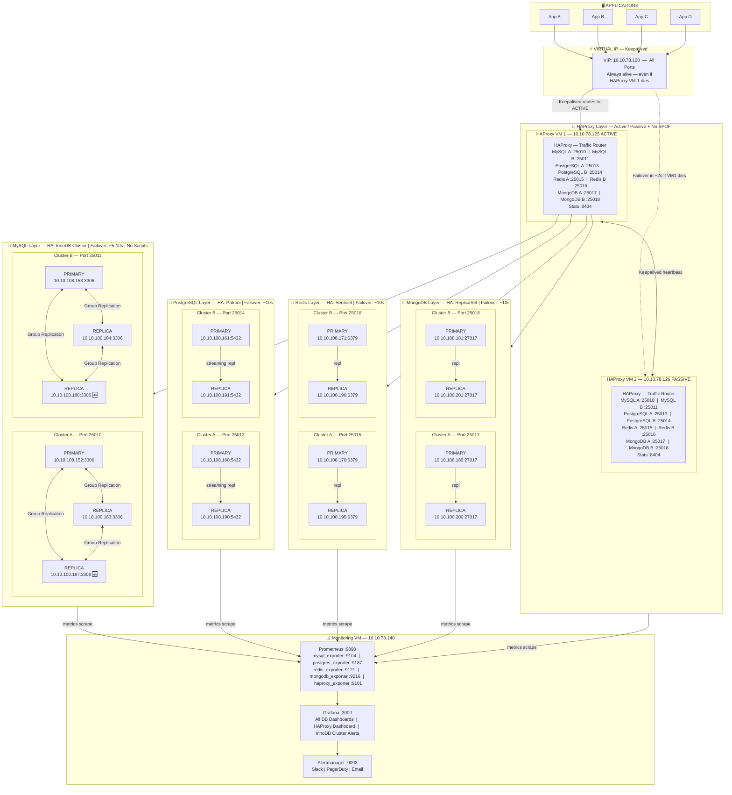
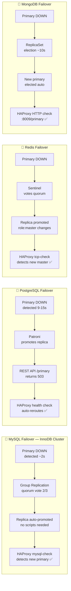
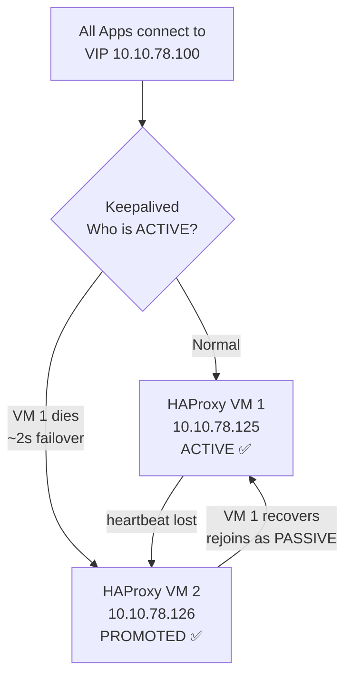
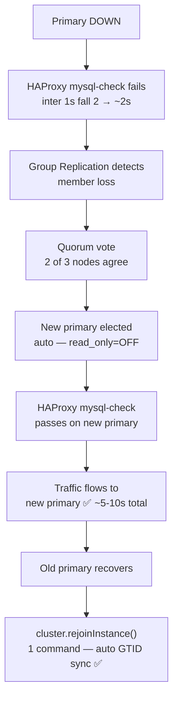
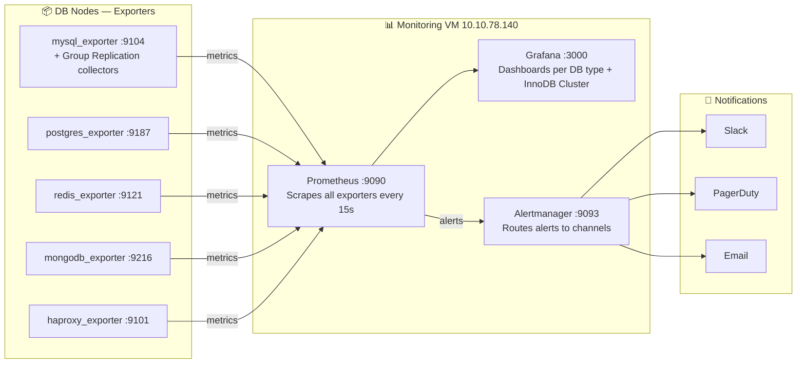

# Database Cluster Architecture
> High Availability Multi-DB Platform — HAProxy + Keepalived + MySQL InnoDB Cluster
> **Version 2.0 — InnoDB Cluster Edition | Replaces Orchestrator + failover.sh**

---

## What Changed from v1

| Item | Before (v1 — Orchestrator) | After (v2 — InnoDB Cluster) |
|---|---|---|
| MySQL HA manager | Orchestrator (archived project) | InnoDB Cluster — Oracle-backed ✅ |
| Failover mechanism | failover.sh + HAProxy socket API | Group Replication consensus — automatic ✅ |
| Failover time (MySQL) | ~15s | ~5-10s ✅ |
| Node requirement | 2 nodes minimum | 3 nodes minimum (quorum) |
| Rejoin failed node | Manual: 5 SQL commands | `cluster.rejoinInstance()` — 1 command ✅ |
| Promote node | Orchestrator CLI + script | `cluster.setPrimaryInstance()` ✅ |
| Split-brain protection | Limited | Built-in quorum voting ✅ |
| Conflict detection | None | Built-in ✅ |
| Data consistency | Async GTID replication | Virtually synchronous ✅ |
| Script maintenance | failover.sh + clusters.json | None required ✅ |
| Long-term support | GitHub archived — no new features | Oracle maintained ✅ |

---

## Architecture Overview



---

## Failover Flow Per DB Type



---

## HAProxy Keepalived Failover



---

## MySQL InnoDB Cluster Failover Detail



---

## Cluster Reference

### MySQL Clusters — InnoDB Cluster (3 Nodes)

| Cluster | Role | IP | Port | HA Manager |
|---|---|---|---|---|
| Cluster A | PRIMARY | 10.10.108.152 | 3306 | InnoDB Cluster (Group Replication) |
| Cluster A | REPLICA | 10.10.100.183 | 3306 | InnoDB Cluster (Group Replication) |
| Cluster A | REPLICA 🆕 | 10.10.100.187 | 3306 | InnoDB Cluster (Group Replication) |
| Cluster B | PRIMARY | 10.10.108.153 | 3306 | InnoDB Cluster (Group Replication) |
| Cluster B | REPLICA | 10.10.100.184 | 3306 | InnoDB Cluster (Group Replication) |
| Cluster B | REPLICA 🆕 | 10.10.100.188 | 3306 | InnoDB Cluster (Group Replication) |

### PostgreSQL Clusters

| Cluster | Role | IP | Port | HA Manager |
|---|---|---|---|---|
| Cluster A | Primary | 10.10.108.160 | 5432 | Patroni |
| Cluster A | Replica | 10.10.100.190 | 5432 | Patroni |
| Cluster B | Primary | 10.10.108.161 | 5432 | Patroni |
| Cluster B | Replica | 10.10.100.191 | 5432 | Patroni |

### Redis Clusters

| Cluster | Role | IP | Port | HA Manager |
|---|---|---|---|---|
| Cluster A | Primary | 10.10.108.170 | 6379 | Sentinel |
| Cluster A | Replica | 10.10.100.195 | 6379 | Sentinel |
| Cluster B | Primary | 10.10.108.171 | 6379 | Sentinel |
| Cluster B | Replica | 10.10.100.196 | 6379 | Sentinel |

### MongoDB Clusters

| Cluster | Role | IP | Port | HA Manager |
|---|---|---|---|---|
| Cluster A | Primary | 10.10.108.180 | 27017 | ReplicaSet |
| Cluster A | Replica | 10.10.100.200 | 27017 | ReplicaSet |
| Cluster B | Primary | 10.10.108.181 | 27017 | ReplicaSet |
| Cluster B | Replica | 10.10.100.201 | 27017 | ReplicaSet |

---

## Port Map

| DB Type | Cluster | Port | HA Manager | Health Check |
|---|---|---|---|---|
| MySQL | Cluster A | 25010 | InnoDB Cluster | `mysql-check user haproxy_check post-41` |
| MySQL | Cluster B | 25011 | InnoDB Cluster | `mysql-check user haproxy_check post-41` |
| PostgreSQL | Cluster A | 25013 | Patroni | `HTTP :8008/primary → 200 OK` |
| PostgreSQL | Cluster B | 25014 | Patroni | `HTTP :8008/primary → 200 OK` |
| Redis | Cluster A | 25015 | Sentinel | `tcp-check role:master` |
| Redis | Cluster B | 25016 | Sentinel | `tcp-check role:master` |
| MongoDB | Cluster A | 25017 | ReplicaSet | `HTTP :8009/primary → 200 OK` |
| MongoDB | Cluster B | 25018 | ReplicaSet | `HTTP :8009/primary → 200 OK` |
| HAProxy | Stats | 8404 | — | Web dashboard |
| MySQL Shell | Admin | — | mysqlsh CLI | `cluster.status()` |
| Patroni | REST API | 8008 | — | `GET /primary` |
| Mongo Health | Sidecar | 8009 | — | `GET /primary` |

---

## HA Manager Responsibilities

| DB Type | HA Manager | Failover Trigger | Failover Time |
|---|---|---|---|
| MySQL | InnoDB Cluster (Group Repl.) | Auto — Group Replication consensus | ~5-10s |
| MariaDB | InnoDB Cluster (Group Repl.) | Auto — Group Replication consensus | ~5-10s |
| PostgreSQL | Patroni | Auto via REST API → HAProxy HTTP check | ~10s |
| Redis | Sentinel | Auto promotes master → HAProxy tcp-check | ~10s |
| MongoDB | ReplicaSet | Auto elects primary → HAProxy HTTP check | ~10s |
| HAProxy | Keepalived | VIP moves to passive VM | ~2s |

---

## HAProxy Configuration

```haproxy
#---------------------------------------------------------------------
# Global
#---------------------------------------------------------------------
global
    log         /dev/log local0
    log         /dev/log local1 notice
    chroot      /var/lib/haproxy
    stats socket /run/haproxy/admin.sock mode 660 level admin expose-fd listeners
    stats timeout 30s
    user        haproxy
    group       haproxy
    daemon
    maxconn     50000
    nbthread    4

#---------------------------------------------------------------------
# Defaults
#---------------------------------------------------------------------
defaults
    log             global
    mode            tcp
    option          tcplog
    option          dontlognull
    option          redispatch
    retries         3
    timeout connect     5s
    timeout client      60s
    timeout server      60s
    timeout check       2s
    timeout tunnel      3600s
    maxconn         20000

#---------------------------------------------------------------------
# Stats Dashboard
# Access: http://10.10.78.125:8404/stats
#---------------------------------------------------------------------
frontend stats
    bind                *:8404
    mode                http
    stats enable
    stats uri           /stats
    stats realm         HAProxy\ Statistics
    stats auth          admin:YourStatsPassword!
    stats refresh       10s
    stats show-legends
    stats show-node
    acl trusted_ip      src 10.10.0.0/16
    http-request deny   if !trusted_ip

#=====================================================================
# MYSQL CLUSTERS — InnoDB Cluster (3 nodes, no backup flag)
# mysql-check routes to PRIMARY only — replicas fail check (read_only=ON)
#=====================================================================

#---------------------------------------------------------------------
# MySQL Cluster A — port 25010
#---------------------------------------------------------------------
frontend mysql_cluster_a
    bind                *:25010
    mode                tcp
    option              tcplog
    default_backend     mysql_back_a

backend mysql_back_a
    mode                tcp
    option              tcp-check
    option              mysql-check user haproxy_check post-41
    balance             first
    default-server      inter 1s rise 1 fall 2 fastinter 500ms on-marked-down shutdown-sessions
    server  mysql-a1    10.10.108.152:3306  check weight 100
    server  mysql-a2    10.10.100.183:3306  check weight 50
    server  mysql-a3    10.10.100.187:3306  check weight 50

#---------------------------------------------------------------------
# MySQL Cluster B — port 25011
#---------------------------------------------------------------------
frontend mysql_cluster_b
    bind                *:25011
    mode                tcp
    option              tcplog
    default_backend     mysql_back_b

backend mysql_back_b
    mode                tcp
    option              tcp-check
    option              mysql-check user haproxy_check post-41
    balance             first
    default-server      inter 1s rise 1 fall 2 fastinter 500ms on-marked-down shutdown-sessions
    server  mysql-b1    10.10.108.153:3306  check weight 100
    server  mysql-b2    10.10.100.184:3306  check weight 50
    server  mysql-b3    10.10.100.188:3306  check weight 50

#=====================================================================
# POSTGRESQL CLUSTERS
#=====================================================================

#---------------------------------------------------------------------
# PostgreSQL Cluster A — port 25013
#---------------------------------------------------------------------
frontend pgsql_cluster_a
    bind                *:25013
    mode                tcp
    option              tcplog
    default_backend     pgsql_back_a

backend pgsql_back_a
    mode                tcp
    option              httpchk GET /primary
    http-check expect   status 200
    balance             first
    default-server      inter 3s rise 2 fall 3 on-marked-down shutdown-sessions
    server  pgsql-primary-a  10.10.108.160:5432  check port 8008 weight 100
    server  pgsql-replica-a  10.10.100.190:5432  check port 8008 weight 1 backup

#---------------------------------------------------------------------
# PostgreSQL Cluster B — port 25014
#---------------------------------------------------------------------
frontend pgsql_cluster_b
    bind                *:25014
    mode                tcp
    option              tcplog
    default_backend     pgsql_back_b

backend pgsql_back_b
    mode                tcp
    option              httpchk GET /primary
    http-check expect   status 200
    balance             first
    default-server      inter 3s rise 2 fall 3 on-marked-down shutdown-sessions
    server  pgsql-primary-b  10.10.108.161:5432  check port 8008 weight 100
    server  pgsql-replica-b  10.10.100.191:5432  check port 8008 weight 1 backup

#=====================================================================
# REDIS CLUSTERS
#=====================================================================

#---------------------------------------------------------------------
# Redis Cluster A — port 25015
#---------------------------------------------------------------------
frontend redis_cluster_a
    bind                *:25015
    mode                tcp
    option              tcplog
    default_backend     redis_back_a

backend redis_back_a
    mode                tcp
    option              tcp-check
    tcp-check           send PING\r\n
    tcp-check           expect string +PONG
    tcp-check           send info\ replication\r\n
    tcp-check           expect string role:master
    tcp-check           send QUIT\r\n
    tcp-check           expect string +OK
    balance             first
    default-server      inter 3s rise 2 fall 3 on-marked-down shutdown-sessions
    server  redis-primary-a  10.10.108.170:6379  check weight 100
    server  redis-replica-a  10.10.100.195:6379  check weight 1 backup

#---------------------------------------------------------------------
# Redis Cluster B — port 25016
#---------------------------------------------------------------------
frontend redis_cluster_b
    bind                *:25016
    mode                tcp
    option              tcplog
    default_backend     redis_back_b

backend redis_back_b
    mode                tcp
    option              tcp-check
    tcp-check           send PING\r\n
    tcp-check           expect string +PONG
    tcp-check           send info\ replication\r\n
    tcp-check           expect string role:master
    tcp-check           send QUIT\r\n
    tcp-check           expect string +OK
    balance             first
    default-server      inter 3s rise 2 fall 3 on-marked-down shutdown-sessions
    server  redis-primary-b  10.10.108.171:6379  check weight 100
    server  redis-replica-b  10.10.100.196:6379  check weight 1 backup

#=====================================================================
# MONGODB CLUSTERS
#=====================================================================

#---------------------------------------------------------------------
# MongoDB Cluster A — port 25017
#---------------------------------------------------------------------
frontend mongo_cluster_a
    bind                *:25017
    mode                tcp
    option              tcplog
    default_backend     mongo_back_a

backend mongo_back_a
    mode                tcp
    option              httpchk GET /primary
    http-check expect   status 200
    balance             first
    default-server      inter 3s rise 2 fall 3 on-marked-down shutdown-sessions
    server  mongo-primary-a  10.10.108.180:27017  check port 8009 weight 100
    server  mongo-replica-a  10.10.100.200:27017  check port 8009 weight 1 backup

#---------------------------------------------------------------------
# MongoDB Cluster B — port 25018
#---------------------------------------------------------------------
frontend mongo_cluster_b
    bind                *:25018
    mode                tcp
    option              tcplog
    default_backend     mongo_back_b

backend mongo_back_b
    mode                tcp
    option              httpchk GET /primary
    http-check expect   status 200
    balance             first
    default-server      inter 3s rise 2 fall 3 on-marked-down shutdown-sessions
    server  mongo-primary-b  10.10.108.181:27017  check port 8009 weight 100
    server  mongo-replica-b  10.10.100.201:27017  check port 8009 weight 1 backup
```

---

## Keepalived Configuration

### HAProxy VM 1 — MASTER `/etc/keepalived/keepalived.conf`

```bash
vrrp_script chk_haproxy {
    script "killall -0 haproxy"
    interval 2
    weight   2
}

vrrp_instance VI_1 {
    state               MASTER
    interface           eth0
    virtual_router_id   51
    priority            101
    advert_int          1

    authentication {
        auth_type   PASS
        auth_pass   YourKeepalivedPass!
    }

    virtual_ipaddress {
        10.10.78.100/24
    }

    track_script {
        chk_haproxy
    }
}
```

### HAProxy VM 2 — BACKUP (same config, change these 2 lines)

```bash
    state               BACKUP
    priority            100
```

---

## MySQL InnoDB Cluster Setup

> Replaces: Orchestrator Raft Configuration
> Run once per MySQL cluster. Example shown for Cluster A.

### Phase 1 — Install MySQL Server + MySQL Shell (All 3 Nodes)

```bash
sudo apt update && sudo apt install -y mysql-server mysql-shell
sudo systemctl enable mysql && sudo systemctl start mysql
```

### Phase 2 — Configure Each Node via MySQL Shell

```bash
# Run on EACH of the 3 nodes individually
mysqlsh
dba.configureLocalInstance('root@localhost:3306')
# Select option 2 — create clusteradmin account
# Set password: ClusterAdmin!2024
# Allow config changes and restart
```

### Phase 3 — Create Cluster and Add Nodes (on mysql-a1 only)

```bash
mysqlsh --user clusteradmin --host 10.10.108.152

var cluster = dba.createCluster('mysql_cluster_a')

cluster.addInstance('clusteradmin@10.10.100.183:3306')
# Choose: Clone — syncs data from primary automatically

cluster.addInstance('clusteradmin@10.10.100.187:3306')
# Choose: Clone

# Verify — all 3 nodes must show ONLINE
cluster.status()
```

### Phase 4 — Create HAProxy Health Check User (Primary Node)

```sql
sudo mysql
CREATE USER 'haproxy_check'@'%' IDENTIFIED WITH mysql_native_password BY '';
GRANT USAGE ON *.* TO 'haproxy_check'@'%';
FLUSH PRIVILEGES;
```

### Daily Operations

| Task | Command |
|---|---|
| Check cluster status | `cluster.status()` |
| Promote specific node | `cluster.setPrimaryInstance('10.10.100.183:3306')` |
| Rejoin failed node | `cluster.rejoinInstance('10.10.108.152:3306')` |
| Add new node | `cluster.addInstance('clusteradmin@<ip>:3306')` |
| Remove node | `cluster.removeInstance('<ip>:3306')` |
| Full outage recovery | `dba.rebootClusterFromCompleteOutage('mysql_cluster_a')` |
| Connect MySQL Shell | `mysqlsh --user clusteradmin --host 10.10.108.152` |
| Get cluster object | `var cluster = dba.getCluster('mysql_cluster_a')` |

---

## MongoDB Health Sidecar

> Required on each MongoDB node — exposes HTTP `/primary` for HAProxy health check

```bash
# /usr/local/bin/mongo-health.sh
#!/bin/bash
IS_PRIMARY=$(mongosh --quiet --eval "db.isMaster().ismaster" 2>/dev/null)
if [ "$IS_PRIMARY" == "true" ]; then
    echo -e "HTTP/1.1 200 OK\r\nContent-Length: 2\r\n\r\nOK"
else
    echo -e "HTTP/1.1 503 Service Unavailable\r\nContent-Length: 9\r\n\r\nnot-primary"
fi
```

```bash
# Run as service on port 8009
while true; do
    /usr/local/bin/mongo-health.sh | nc -l -p 8009 -q 1
done
```

---

## Redis Sentinel HAProxy Notify Script

```bash
# /etc/redis/reconfig-haproxy.sh
#!/bin/bash
NEW_MASTER_IP=$6
OLD_MASTER_IP=$4
HAPROXY_SOCKET="/run/haproxy/admin.sock"

# Disable old master
echo "show servers state" | socat stdio "$HAPROXY_SOCKET" | \
awk -v old="$OLD_MASTER_IP" '{if($4==old) print $2" "$3}' | \
while read backend server; do
    echo "disable server $backend/$server" | socat stdio "$HAPROXY_SOCKET"
done

# Enable new master
echo "show servers state" | socat stdio "$HAPROXY_SOCKET" | \
awk -v new="$NEW_MASTER_IP" '{if($4==new) print $2" "$3}' | \
while read backend server; do
    echo "enable server $backend/$server"  | socat stdio "$HAPROXY_SOCKET"
    echo "set server $backend/$server weight 100" | socat stdio "$HAPROXY_SOCKET"
done

sudo systemctl reload haproxy
```

---

## Monitoring Stack



### mysql_exporter — InnoDB Cluster Flags

```bash
mysql_exporter \
  --collect.perf_schema.replication_group_members \
  --collect.perf_schema.replication_group_member_stats \
  --collect.perf_schema.replication_applier_status_by_worker \
  --collect.info_schema.innodb_metrics \
  --collect.global_status \
  --collect.global_variables \
  --web.listen-address=":9104"
```

### InnoDB Cluster Alert Rules

| Alert | Condition | Severity |
|---|---|---|
| MySQLMemberOffline | `member_state != ONLINE` | Critical |
| MySQLTransactionBacklog | `transactions_in_queue > 100` for 1m | Warning |
| MySQLConflictDetected | `count_conflicts_detected` increases | Warning |
| MySQLNoFaultTolerance | ONLINE members < 2 | Critical |
| MySQLPrimaryChanged | `primary_member` value changes | Info |
| MySQLClusterDegraded | cluster status != OK | Critical |

---

## Production Readiness Checklist

| Component | Status | Notes |
|---|---|---|
| HAProxy Active/Passive | ✅ | Keepalived VIP — unchanged |
| HAProxy tunnel timeout | ✅ | `timeout tunnel 3600s` — unchanged |
| MySQL HA — InnoDB Cluster 3 nodes | ✅ | Group Replication replaces Orchestrator |
| MySQL auto-failover — no scripts | ✅ | Built-in consensus — failover.sh removed |
| MySQL rejoin — one command | ✅ | `cluster.rejoinInstance()` |
| MySQL promote — one command | ✅ | `cluster.setPrimaryInstance()` |
| MySQL split-brain protection | ✅ | Quorum voting — 2 of 3 nodes required |
| MySQL conflict detection | ✅ | Built-in Group Replication feature |
| PostgreSQL HA | ✅ | Patroni + HTTP check — unchanged |
| Redis HA | ✅ | Sentinel + notify script — unchanged |
| MongoDB HA | ✅ | ReplicaSet + sidecar HTTP check — unchanged |
| No SPOF on proxy layer | ✅ | 2x HAProxy + Keepalived — unchanged |
| No custom failover scripts (MySQL) | ✅ | Orchestrator + failover.sh eliminated |
| Group Replication metrics | 🆕 | member state, queue depth, conflict count |
| InnoDB-specific alerts | 🆕 | 6 new alert rules added |
| Monitoring isolated VM | ✅ | 10.10.78.140 — unchanged |
| Alerts configured | ✅ | Alertmanager → Slack / PagerDuty / Email |
| DBaaS provisioning | ✅ | mysqlsh + haproxy.cfg only — no scripts |

---

## Summary

```
✅ Single VIP entry point         — apps connect to one IP always
✅ HAProxy Active/Passive         — no proxy SPOF via Keepalived
✅ Separate port per cluster      — full traffic isolation
✅ Correct HA tool per DB type    — InnoDB Cluster / Patroni / Sentinel / ReplicaSet
✅ Correct health check per DB    — mysql-check / HTTP check / tcp-check role:master
✅ Auto failover all DB types     — zero manual intervention
✅ MySQL failover — no scripts    — Group Replication built-in consensus
✅ MySQL rejoin/promote           — cluster.rejoinInstance() / setPrimaryInstance()
✅ Zero cross-cluster impact      — cluster A down = others unaffected
✅ Monitoring per DB type         — Prometheus exporters + Grafana
✅ InnoDB Group Replication       — conflict detection, member state, queue depth
✅ Alerting                       — Alertmanager → Slack / PagerDuty / Email
✅ Scalable DBaaS provisioning    — add cluster = mysqlsh + haproxy.cfg only
✅ Long-term maintainability      — Oracle-backed InnoDB, no archived dependencies
```